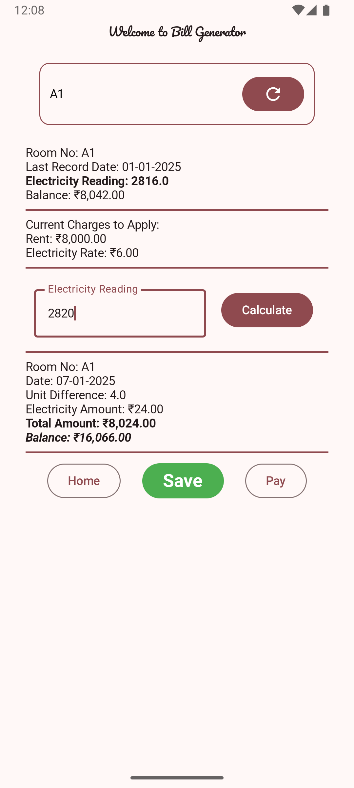
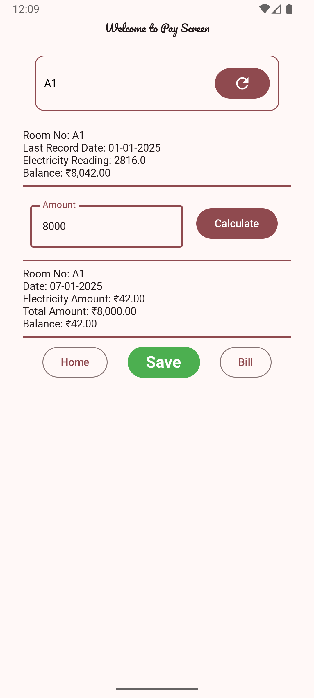

# 🏠 Tenant Rent Management Web Page

Welcome to the Tenant Rent Management Web Page! This platform provides an overview of the tenant rent management system. The **web page is publicly accessible**, showcasing the project details and features. However, the **Android app is private** and can only be used upon special request.

---

## ✨ Features
- 💼 **Manage Tenants**: Add, update, and view tenant details.
- 📊 **Track Payments**: Record and track rental payments with pending amounts.
- 🔌 **Electricity Billing**: Automatically calculate electricity charges based on meter readings.
- 📝 **Statements**: Generate detailed statements for tenants showing payment history and pending dues.
- 🔍 **Search & Filter**: Quickly find tenant details and payment records.

---

## 🛠️ Technologies Used
- **Kotlin** for backend development
- **Room Database** for data storage
- **HTML, CSS, and JavaScript** for the frontend
- **Jetpack Compose** for modern UI integration

---

## 🌐 How to Access the Web Page
- The web page is public and can be accessed at: [Tenant Rent Management Web Page](https://pnrt.github.io/homebasewebpage/)
- Explore the features, documentation, and app previews.

---

## 📱 App Access
The Android app for this project is private and not publicly available.
- **Special Access**: Usage of the app is restricted and can only be granted upon special request.
- If interested, contact the owner with valid reasons for access.

### 📷 App Previews
Below are screenshots of the Tenant Rent Management Android App:

<p align="center">
  
  
</p>

<p align="center">
  
  
</p>

---

## ⚙️ Local Setup for Development
If you are authorized to work on this project:
1. Clone the repository:
    ```bash
    git clone https://github.com/<your-github-username>/tenant-rent-management.git
    ```
2. Open the project in your preferred IDE.
3. Set up your environment variables for secure access.
4. Build and run the web page locally on your system.

---

## 📜 License
This project is licensed under the **Restricted Use License**. Please read the terms below:

### **Restricted Use License:**
- The source code and assets of this project are for personal use only.
- Redistribution, modification, or commercial use of this project or its components is strictly prohibited without explicit written consent from the owner.

For further details, please check the [LICENSE](LICENSE) file in the repository.

---

## 📧 Contact
For any inquiries or special access requests, contact the owner directly:
- **Email:** pankaj.enggr@gmail.com

---

Thank you for respecting the privacy and policies of this project! 🏡
